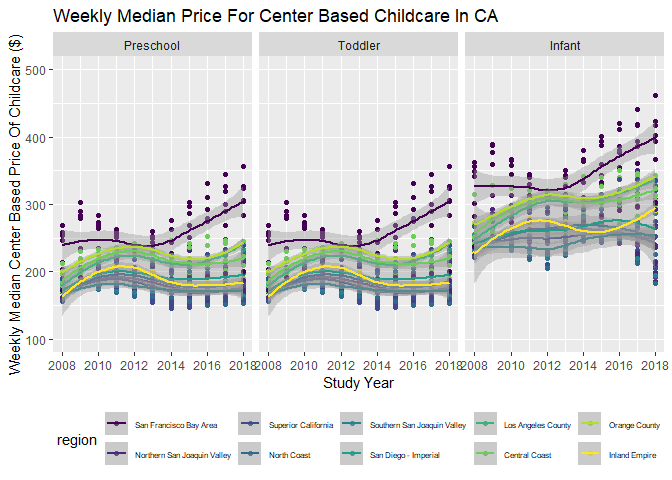
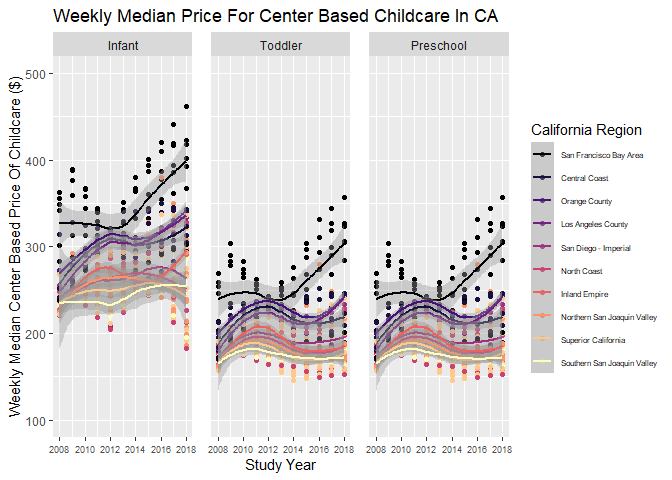

# STAT210_SP25 Lab 6 Childcare Costs in California
River Mckegney
2025-05-10

## The Data

In this lab we’re going look at the median weekly cost of childcare in
California. A detailed description of the data can be found
[here](https://github.com/rfordatascience/tidytuesday/blob/master/data/2023/2023-05-09/readme.md).

The data come to us from
[TidyTuesday](https://github.com/rfordatascience/tidytuesday).

**0. Load the appropriate libraries and the data.**

``` r
library(tidyverse) # Forcats functions and more
library(lubridate) # Timeseries functions
library(ggh4x) # Adjust facet panel sizing
```

``` r
options(readr.show_col_types = FALSE)

childcare_costs <- read_csv('https://raw.githubusercontent.com/rfordatascience/tidytuesday/master/data/2023/2023-05-09/childcare_costs.csv')

counties <- read_csv('https://raw.githubusercontent.com/rfordatascience/tidytuesday/master/data/2023/2023-05-09/counties.csv')

#spec(counties) # View col types
#spec(childcare_costs) # View col types
```

Line 1  
Source used to hide output warning:
<https://github.com/tidyverse/readr/issues/1250>

**1. Briefly describe the dataset (~ 4 sentences). What information does
it contain?**

Question 1 Response By River Mckegney:

The ‘childcare_costs’ dataset contains information about individuals
such as unemployment rates at various ages, employment rates by gender
and age, income, population size, ethnic background, family size,
occupational field, and other demographic data as well as its associated
location and date data. The ‘counties’ dataset contains state and county
data information. Note this data contains location data from various
states and not just California.

## California Childcare Costs

Let’s start by focusing only on California.

**2. Create a `ca_childcare` dataset of childcare costs in California,
containing (1) county information and (2) just the year and childcare
cost variable information from the `childcare_costs` dataset.**

*Hint: There are 58 counties in CA and 11 years in the dataset.
Therefore, your new dataset should have 53 x 11 = 638 observations. The
final data set should have study year, median household income expressed
in 2018 dollars, all the variables associated with full-time median
price charged for Center-based Care, and California county names*

``` r
# Merged dataframe
location_childcare_merged <- counties %>% 
  inner_join(y = childcare_costs, by = "county_fips_code")

# Dataframe of selected variables
ca_childcare <- location_childcare_merged %>%
  filter(state_name == "California") %>%
  select(county_name, study_year, mhi_2018, mcsa, mfccsa, mc_infant, mc_toddler, mc_preschool, mfcc_infant, mfcc_toddler, mfcc_preschool) 
```

**3. Using a function from the `forcats` package, complete the code
below to create a new variable where each county is categorized into one
of the [10 Census regions](https://census.ca.gov/regions/) in
California. Use the Region description (from the plot), not the Region
number. An example region has been started for you.**

*Hint: This is probably a good place to use ChatGPT to reduce on tedious
work. But you do need to know how to prompt ChatGPT to make it useful!*

``` r
ca_childcare <- ca_childcare |>
  mutate(county_name = str_remove(county_name, " County")) |> # Remove the word 'county' from all variable names within the county_name column
  mutate(region = fct_collapse(county_name,
    'Superior California' = c("Butte", "Colusa", "El Dorado", "Glenn", "Lassen", "Modoc", "Nevada", "Placer", "Plumas", "Sacramento", "Shasta", "Sierra", "Siskiyou", "Sutter", "Tehama", "Yolo", "Yuba"),
    'North Coast' = c("Del Norte", "Humboldt", "Lake", "Mendocino", "Napa", "Sonoma", "Trinity"), 
    'San Francisco Bay Area' = c("Alameda", "Contra Costa", "Marin", "San Francisco", "San Mateo", "Santa Clara", "Solano"),
    'Northern San Joaquin Valley' = c("Alpine", "Amador", "Calaveras", "Madera", "Mariposa", "Merced", "Mono", "San Joaquin", "Stanislaus", "Tuolumne"),
    'Central Coast' = c("Monterey", "San Benito", "San Luis Obispo", "Santa Barbara", "Santa Cruz", "Ventura"),
    'Southern San Joaquin Valley' = c("Fresno", "Inyo", "Kern", "Kings", "Tulare"),
    'Inland Empire' = c("Riverside", "San Bernardino"),
    'Los Angeles County' = c("Los Angeles"),
    'Orange County' = c("Orange"),
    'San Diego - Imperial' = c("Imperial", "San Diego"))) # Create new col 'region' that sorts names into new groupings based on the 10 census region description names
```

Line 3  
Reference used to find forcats function required to carry out code
script in its given format.
<https://forcats.tidyverse.org/reference/index.html>

**4. Let’s consider the median household income of each region, and how
that income has changed over time. Create a table with ten rows, one for
each region, and two columns, one for 2008 and one for 2018. The cells
should contain the `median` of the median household income (expressed in
2018 dollars) of the `region` and the `study_year`. Arrange the rows by
2018 values.**

``` r
# Hint: You will want to calculate the median of median income before you make columns for 2008/2018 by transforming the data

# River's code
ca_childcare |>
  group_by(region, study_year) |>
  summarize(med_income = median(mhi_2018)) |>
  filter(study_year == 2018 | study_year == 2008) |>
  arrange(desc(med_income))
```

    `summarise()` has grouped output by 'region'. You can override using the
    `.groups` argument.

    # A tibble: 20 × 3
    # Groups:   region [10]
       region                      study_year med_income
       <fct>                            <dbl>      <dbl>
     1 San Francisco Bay Area            2018    104552 
     2 San Francisco Bay Area            2008     90412.
     3 Orange County                     2008     86452.
     4 Orange County                     2018     85398 
     5 Central Coast                     2018     74849 
     6 Central Coast                     2008     72979 
     7 Inland Empire                     2008     65977.
     8 Los Angeles County                2018     64251 
     9 Los Angeles County                2008     63471.
    10 Inland Empire                     2018     62056 
    11 San Diego - Imperial              2018     60344.
    12 Northern San Joaquin Valley       2008     59108.
    13 San Diego - Imperial              2008     58201.
    14 Superior California               2008     57831.
    15 Northern San Joaquin Valley       2018     57769 
    16 Superior California               2018     53270 
    17 Southern San Joaquin Valley       2008     52676.
    18 Southern San Joaquin Valley       2018     52479 
    19 North Coast                       2008     47862.
    20 North Coast                       2018     45528 

**5. Which California `region` had the lowest `median` full-time median
weekly price for center-based childcare for infants in 2018? Does this
`region` correspond to the `region` with the lowest `median` income in
2018 that you found in Q4?**

*Hint: The code should give me the EXACT answer. This means having the
code output the exact row(s) and variable(s) necessary for providing the
solution. Consider the `slice()` functions.*

``` r
ca_childcare |> 
  group_by(region, study_year) |>
  summarize(med_price_CBC = median(mc_infant)) |>
  filter(study_year == 2018) |>
  arrange(med_price_CBC)
```

    `summarise()` has grouped output by 'region'. You can override using the
    `.groups` argument.

    # A tibble: 10 × 3
    # Groups:   region [10]
       region                      study_year med_price_CBC
       <fct>                            <dbl>         <dbl>
     1 Superior California               2018          215.
     2 North Coast                       2018          226.
     3 Northern San Joaquin Valley       2018          238.
     4 San Diego - Imperial              2018          262.
     5 Southern San Joaquin Valley       2018          287.
     6 Inland Empire                     2018          294.
     7 Central Coast                     2018          318.
     8 Los Angeles County                2018          334.
     9 Orange County                     2018          341.
    10 San Francisco Bay Area            2018          402.

River’s response to Q5: \> Superior California is the region that
displays the lowest median full time median weekly price for center
based childcare for infants during 2018. This does not quite match up
with the region that showed the lowest median household income, from
question 5 which was the North Coast. Though Superior California did
followed closely behind, with a generally low median household income in
2018 of $53270.00 when compared to all other regions.

**6. Recreate the plot (look at online instructions) that shows, for all
ten regions, the change over time of the full-time median price for
center-based childcare for infants, toddlers, and preschoolers. Recreate
the plot. You do not have to replicate the exact colors or theme, but
your plot should have the same content, including the order of the
facets and legend, reader-friendly labels, axes breaks, and a smooth
function.**

``` r
# River's First Attempt, Working Draft

ca_childcare |>
  select(study_year, county_name, mc_infant, mc_toddler, mc_preschool, region) |> # Select cols used
  pivot_longer(cols = starts_with("mc_"), # Merge three numerical cols into one, select cols by "mc_"
               names_to = "childcare_youth_type", # Move three categorical vars into a col
               values_to = "med_center_childcare_value") |> # Move all numerical values into another col
  mutate(childcare_youth_type = fct_recode(childcare_youth_type,
                                           "Infant" = "mc_infant",
                                           "Toddler" = "mc_toddler",                
                                           "Preschool" = "mc_preschool")) |> # Change names of categorical col variables into simple description for graph 
  ggplot() + 
  geom_point(aes(x = study_year, y = med_center_childcare_value, color = region)) +
  geom_smooth(aes(x = study_year, y = med_center_childcare_value, color = region)) + 
  facet_wrap(~ fct_reorder(childcare_youth_type, med_center_childcare_value)) +
                                                                                 # Facet numerical values by categorical col
  labs(title = "Weekly Median Price For Center Based Childcare In CA",
       x = "Study Year",
       y = "Weekly Median Center Based Price Of Childcare ($)") +
  theme(legend.position = "bottom", legend.text = element_text(size = 6)) + # Adjust legend position & size
  scale_y_continuous(limits = c(100, 500)) + # Set y-axis value range & tick marks
  scale_x_continuous(breaks = c(2008, 2010, 2012, 2014, 2016, 2018)) + # Set x-axis year tick marks
  scale_color_viridis_d() 
```

Line 8  
Source used to reference forcat’s fct_recode function formatting:
<https://forcats.tidyverse.org/reference/fct_recode.html>.

Line 9  
Reference used as troubleshoot that reminded me the order to specify
naming, as fct_recode(column, “new_name” = “old_name”).
<https://stackoverflow.com/questions/67197228/changing-variable-name-in-box-plot-using-fct-recode>.

Line 15  
Reference used to utilize fct_reorder:
<https://mpn.metworx.com/packages/forcats/0.5.0/reference/fct_reorder.html>.

<!-- -->

    `geom_smooth()` using method = 'loess' and formula = 'y ~ x'



``` r
# Rivers Finished Graph

ca_childcare |>
  select(study_year, county_name, mc_infant, mc_toddler, mc_preschool, region) |> # Select cols used
  pivot_longer(cols = starts_with("mc_"), # Merge three numerical cols into one, select cols by "mc_"
               names_to = "childcare_youth_type", # Move three categorical vars into a col
               values_to = "med_center_childcare_value") |> # Move all numerical values into another col
  mutate(childcare_youth_type = fct_recode(childcare_youth_type,                     
                                           "Infant" = "mc_infant",                   
                                           "Toddler" = "mc_toddler",                
                                           "Preschool" = "mc_preschool")) |> # Change names of categorical col variables into simple description for graph 
  mutate(region = fct_reorder(region, med_center_childcare_value, .desc = TRUE)) |>
  ggplot() + 
  geom_point(aes(x = study_year, y = med_center_childcare_value, color = region)) +
  geom_smooth(aes(x = study_year, y = med_center_childcare_value, color = region)) + 
  facet_grid(~ factor(childcare_youth_type, c("Infant", "Toddler", "Preschool"))) +
                                                                                     # Facet numerical values by categorical col
  labs(title = "Weekly Median Price For Center Based Childcare In CA",
       x = "Study Year",
       y = "Weekly Median Center Based Price Of Childcare ($)") +
  theme(legend.position = "right", legend.text = element_text(size = 6),
       panel.spacing = unit(.5, "cm"), axis.text.x.bottom = element_text(size = 7)) + # Adjust legend position text size & overall size, distance between facet panels, and timeline tick text size
  guides(color = guide_legend(title = "California Region")) +
  scale_y_continuous(limits = c(100, 500)) + # Set y-axis value range & tick marks
  scale_x_continuous(breaks = c(2008, 2010, 2012, 2014, 2016, 2018)) + # Set x-axis year tick marks
  scale_color_viridis_d(option = "magma")
```

Line 16  
Alternative method to custom set order of facet:
<https://forum.posit.co/t/re-ordering-facet-wrap/141999/2>.

<!-- -->

    `geom_smooth()` using method = 'loess' and formula = 'y ~ x'



# Data Sources:

1.  Data Science Learning Community (2024). Tidy Tuesday: A weekly
    social data project. https://tidytues.day
    <https://github.com/rfordatascience/tidytuesday/blob/main/data/2023/2023-05-09/readme.md>.

2.  United States Department of Labor. Women’s Bureau. National Database
    of Childcare Prices.
    <https://www.dol.gov/agencies/wb/topics/featured-childcare>.

# References:

1.  Github. Problem with options(readr.show_col_types = FALSE) #1250.
    <https://github.com/tidyverse/readr/issues/1250>.

2.  Wickham H and Posit (2023). Forcats, “Function reference”.
    <https://forcats.tidyverse.org/reference/index.html>.

3.  Wickham H and Posit (2023). Forcats, “Change factor levels by hand”.
    Source code:
    <https://github.com/tidyverse/forcats/blob/HEAD/R/recode.R>. website
    url: <https://forcats.tidyverse.org/reference/fct_recode.html>.

4.  Stackoverflow. “changing variable name in box plot using
    fct_recode”. Last modified 2021-04-22.
    <https://stackoverflow.com/questions/67197228/changing-variable-name-in-box-plot-using-fct-recode>.

5.  Forcats. Developed by Hadley Wickham, Rstudio. “Reorder factor
    levels by sorting along another variable”. Source code:
    <https://github.com/tidyverse/forcats/blob/main/R/reorder.R>.
    Webpage html url:
    <https://mpn.metworx.com/packages/forcats/0.5.0/reference/fct_reorder.html>.

6.  Posit Community. “Re-ordering facet_wrap”.
    <https://forum.posit.co/t/re-ordering-facet-wrap/141999/2>.
